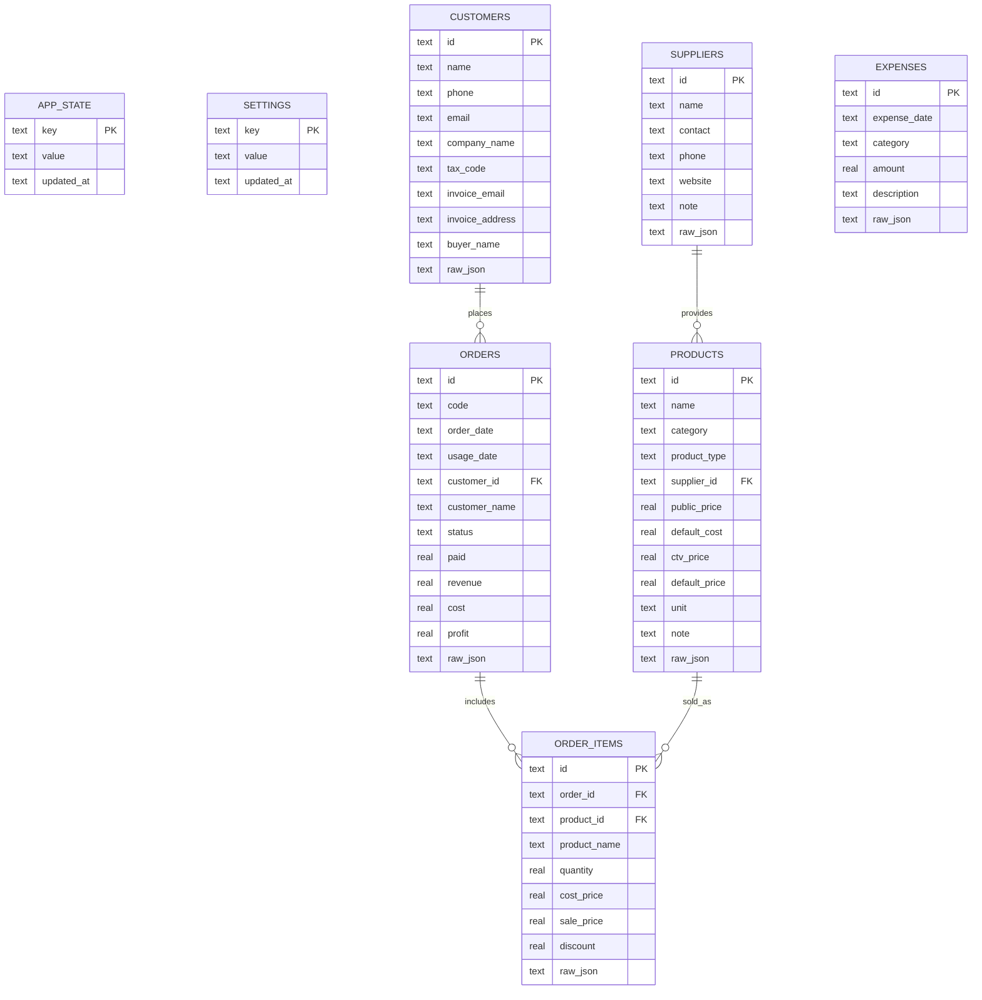

# ERD - Sổ Doanh Thu HKD SQLite

```mermaid
erDiagram
  APP_STATE {
    text key PK
    text value
    text updated_at
  }

  SETTINGS {
    text key PK
    text value
    text updated_at
  }

  PRODUCTS {
    text id PK
    text name
    text category
    text product_type
    text supplier_id FK
    real public_price
    real default_cost
    real ctv_price
    real default_price
    text unit
    text note
    text raw_json
  }

  CUSTOMERS {
    text id PK
    text name
    text phone
    text email
    text company_name
    text tax_code
    text invoice_email
    text invoice_address
    text buyer_name
    text raw_json
  }

  SUPPLIERS {
    text id PK
    text name
    text contact
    text phone
    text website
    text note
    text raw_json
  }

  ORDERS {
    text id PK
    text code
    text order_date
    text usage_date
    text customer_id FK
    text customer_name
    text status
    real paid
    real revenue
    real cost
    real profit
    text raw_json
  }

  ORDER_ITEMS {
    text id PK
    text order_id FK
    text product_id FK
    text product_name
    real quantity
    real cost_price
    real sale_price
    real discount
    text raw_json
  }

  EXPENSES {
    text id PK
    text expense_date
    text category
    real amount
    text description
    text raw_json
  }

  SUPPLIERS ||--o{ PRODUCTS : provides
  CUSTOMERS ||--o{ ORDERS : places
  ORDERS ||--o{ ORDER_ITEMS : includes
  PRODUCTS ||--o{ ORDER_ITEMS : sold_as
```
